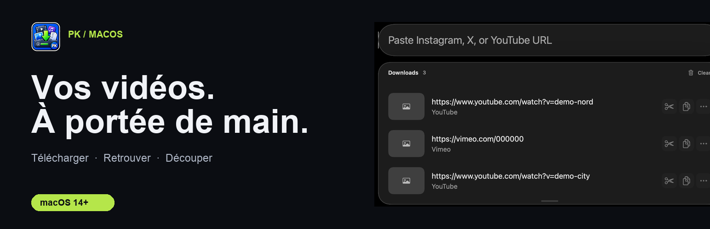
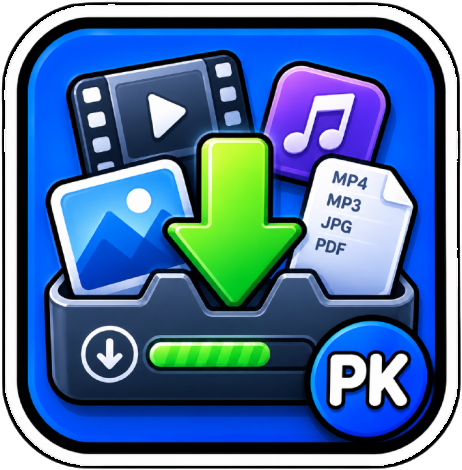
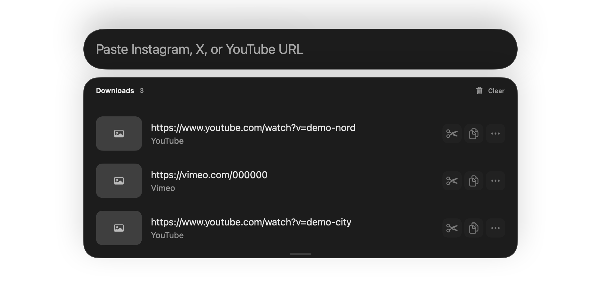

# PKMediaDownloader








[🇫🇷 FR](README.md) · [🇬🇧 EN](README_en.md)

📦 version **v1.2026.12** · ☕ [Ko-fi](https://ko-fi.com/pouark)

✨ Téléchargeur vidéo natif macOS basé sur yt-dlp — supporte YouTube (playlists), Instagram, X/Twitter, TikTok et des milliers d'autres sites.

## ✅ Fonctionnalités

- Téléchargement depuis des milliers de sites via [yt-dlp](https://github.com/yt-dlp/yt-dlp)
- **Playlists YouTube** — détection automatique des URLs playlist
- **Auth social media** — support cookies pour Instagram, X/Twitter, TikTok
- Conversion/merge en MP4 (H.264/AAC)
- **Auto-copie** dans le presse-papiers après téléchargement
- **Historique** avec thumbnails et actions rapides
- **Trim vidéo** — couper, sauvegarder ou copier un extrait
- **Raccourci clavier universel** — active l'app depuis n'importe où (Cmd+Shift+6)
- **Icône menubar** — accès rapide
- **Auto-paste** — les URLs du presse-papiers sont détectées automatiquement
- **Cobalt en secours** — lien externe proposé après un échec de téléchargement, sans envoi automatique de l'URL

## 🧠 Utilisation

1. Colle une URL (Instagram, X, TikTok, YouTube, etc.)
2. Le téléchargement démarre automatiquement
3. Le fichier est copié dans le presse-papiers
4. L'éditeur de trim s'ouvre pour couper la vidéo
5. L'historique garde toutes tes vidéos

### Playlists YouTube
Colle simplement une URL de playlist YouTube — l'app détecte automatiquement `list=` dans l'URL et télécharge toute la playlist.

### Social Media (Instagram, X, TikTok)
Choisis le navigateur connecté dans **Settings → Social Media Auth**. Si la lecture de sa session échoue, sélectionne un fichier `cookies.txt` exporté séparément.

Si un site ne fonctionne pas avec yt-dlp, ouvre [Cobalt](https://cobalt.tools/) comme **solution externe de secours** ([code source](https://github.com/imputnet/cobalt)). L'app n'envoie jamais ton URL à Cobalt automatiquement ; consulte ses conditions et les droits sur le contenu avant de l'utiliser.

## ⚙️ Réglages

| Paramètre | Description |
|---|---|
| Dossier de téléchargement | Choisir où sauvegarder les vidéos |
| Auto-copie | Copier automatiquement dans le presse-papiers |
| Cookies | Session du navigateur ou fichier `cookies.txt` facultatif |
| Accessibilité | Nécessaire pour les raccourcis clavier globaux |
| Raccourcis | Cmd+Shift+6 (activer), Return (copier), Cmd+Return (trim) |

## 🧾 Raccourcis Clavier

| Raccourci | Action |
|---|---|
| **Cmd+Shift+6** | Activer l'app (global) |
| **Return** | Copier le fichier sélectionné |
| **Cmd+Return** | Ouvrir le mode trim |
| **Tab** | basculer entre input et historique |
| **↑↓** | Naviguer dans l'historique |

## 🖥️ CLI (pkmd)

`pkmd` est un **binaire indépendant** (même moteur, même historique que l'app) — livré dans l'app et en artefact CI :

```sh
alias pkmd='/Applications/PKMediaDownloader.app/Contents/MacOS/pkmd'

pkmd https://youtu.be/...   # télécharge (progression inline)
pkmd list 20                # 20 dernières entrées d'historique
pkmd engines                # moteur : chemin + version yt-dlp
pkmd update-engine          # met à jour yt-dlp
```

## 📦 Build & Run

```sh
# Prérequis
xcode-select --install
brew install yt-dlp ffmpeg

# Build
swift build

# Lancer
swift run

# Ou via le script
./script/build_and_run.sh
```

## 🧾 Changelog

Voir le [CHANGELOG.md](CHANGELOG.md) pour l'historique complet.

## 📦 Installation

**Homebrew** (macOS 14+, Apple Silicon) :

```sh
brew install --cask mondary/tap/pkmedia-downloader
brew upgrade --cask mondary/tap/pkmedia-downloader
```

**DMG direct** : [PKMediaDownloader-v1.2026.12-macos-arm64.dmg](https://github.com/mondary/media-downloader/releases/download/v1.2026.12/PKMediaDownloader-v1.2026.12-macos-arm64.dmg) — ouvrir et glisser l'app dans Applications. Cette première release est signée **ad hoc**, non notarisée : macOS peut demander une autorisation manuelle dans Réglages système → Confidentialité et sécurité au premier lancement. `yt-dlp` et `ffmpeg` sont requis (installés par le cask ; pour le DMG seul : `brew install yt-dlp ffmpeg`).

Téléchargement en terminal :

```sh
curl -fL -o PKMediaDownloader-v1.2026.12-macos-arm64.dmg https://github.com/mondary/media-downloader/releases/download/v1.2026.12/PKMediaDownloader-v1.2026.12-macos-arm64.dmg
```

Voir la [page promo bilingue](store/index.html) et la [proposition de rangement](docs/REFACTORING.md). Les deux captures ci-dessus proviennent des vues natives avec des données fictives ; la vidéo historique montre seulement l'icône.

## 🔗 Liens

- Projet original : [pixel-point/media-downloader](https://github.com/pixel-point/media-downloader)
- Fork : [PKMediaDownloader](https://github.com/mondary/media-downloader)
- yt-dlp : [github.com/yt-dlp/yt-dlp](https://github.com/yt-dlp/yt-dlp)

---

🇬🇧 See [README_en.md](README_en.md) for English version.
