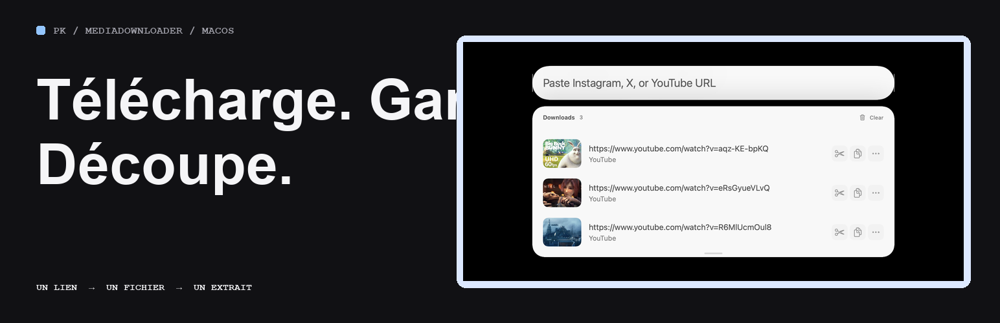
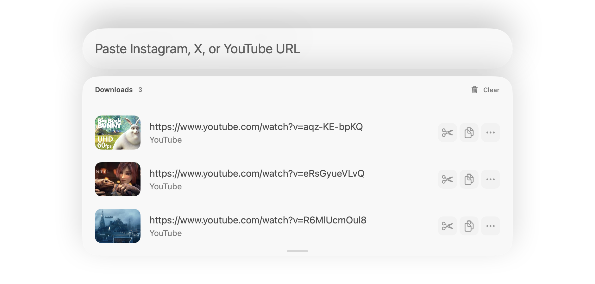
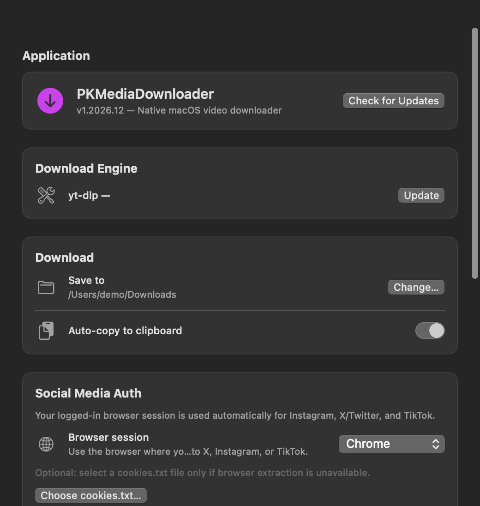

# PKMediaDownloader







[🇬🇧 EN](README_en.md) · [🇫🇷 FR](README.md)

📦 project **v1.2026.32** · installable release **v1.2026.12** · ☕ [Ko-fi](https://ko-fi.com/pouark)

✨ Native macOS video downloader powered by yt-dlp — supports YouTube (playlists), Instagram, X/Twitter, TikTok and thousands more sites.

## ✅ Features

- Download from thousands of sites via [yt-dlp](https://github.com/yt-dlp/yt-dlp)
- **YouTube playlists** — automatic playlist URL detection
- **Social media auth** — cookie support for Instagram, X/Twitter, TikTok
- Convert/merge to MP4 (H.264/AAC)
- **Auto-copy** to clipboard after download
- **History** with thumbnails and quick actions
- **Video trim** — cut, save or copy an excerpt
- **Universal keyboard shortcut** — activate the app from anywhere (Cmd+Shift+6)
- **Menubar icon** — quick access
- **Auto-paste** — clipboard URLs are detected automatically
- **Cobalt fallback** — external link shown after a failed download, without automatically sending the URL
- **Sparkle updates** — in-app update checks with Stable and Dev channels
- **PK settings** — searchable sidebar with separate Credits, Support (Ko-fi and project links without duplicates), Project Library and About with Stable/Dev comparison

## 🧠 Usage

1. Paste a URL (Instagram, X, TikTok, YouTube, etc.)
2. Download starts automatically
3. File is copied to clipboard
4. Trim editor opens to cut the video
5. History keeps all your videos

### YouTube Playlists
Simply paste a YouTube playlist URL — the app automatically detects `list=` in the URL and downloads the entire playlist.

### Social Media (Instagram, X, TikTok)
Choose the browser where you're signed in under **Settings → Social Media Auth**. If browser session extraction fails, select a separately exported `cookies.txt` file.

If a site fails with yt-dlp, open [Cobalt](https://cobalt.tools/) as an **external fallback** ([source code](https://github.com/imputnet/cobalt)). The app never sends your URL to Cobalt automatically; check its terms and your rights to the content before using it.

## ⚙️ Settings

| Setting | Description |
|---|---|
| Download folder | Choose where to save videos |
| Auto-copy | Automatically copy to clipboard |
| Cookies | Browser session or optional `cookies.txt` file |
| Accessibility | Required for global keyboard shortcuts |
| Shortcuts | Cmd+Shift+6 (activate), Return (copy), Cmd+Return (trim) |

## 🧾 Keyboard Shortcuts

| Shortcut | Action |
|---|---|
| **Cmd+Shift+6** | Activate app (global) |
| **Return** | Copy selected file |
| **Cmd+Return** | Open trim mode |
| **Tab** | Toggle between input and history |
| **↑↓** | Navigate history |

## 🖥️ CLI (pkmd)

`pkmd` is a **standalone binary** (same engine and history as the app) — shipped inside the app and as a CI artifact:

```sh
alias pkmd='/Applications/PKMediaDownloader.app/Contents/MacOS/pkmd'

pkmd https://youtu.be/...   # download (inline progress)
pkmd list 20                # last 20 history entries
pkmd engines                # engine: yt-dlp path + version
pkmd update-engine          # update yt-dlp
```

## 📦 Build & Run

```sh
# Requirements
xcode-select --install
brew install yt-dlp ffmpeg

# Build
swift build

# Run
swift run

# Or via script
./script/build_and_run.sh
```

## 🧾 Changelog

See [CHANGELOG.md](CHANGELOG.md) for the full history.

## 📦 Installation

**Homebrew** (macOS 14+, Apple Silicon):

```sh
brew install --cask mondary/tap/pkmedia-downloader
brew upgrade --cask mondary/tap/pkmedia-downloader
```

**Direct DMG**: [PKMediaDownloader-v1.2026.12-macos-arm64.dmg](https://github.com/mondary/media-downloader/releases/download/v1.2026.12/PKMediaDownloader-v1.2026.12-macos-arm64.dmg) — open it and drag the app to Applications. This first release is **ad-hoc signed**, not notarized: macOS may require manual approval in System Settings → Privacy & Security on first launch. `yt-dlp` and `ffmpeg` are required (installed by the cask; for DMG alone: `brew install yt-dlp ffmpeg`).

Terminal download:

```sh
curl -fL -o PKMediaDownloader-v1.2026.12-macos-arm64.dmg https://github.com/mondary/media-downloader/releases/download/v1.2026.12/PKMediaDownloader-v1.2026.12-macos-arm64.dmg
```

See the [current bilingual promo page](store/website/index.html) and the [v1](store/v1/), [v2](store/v2/) and [v3](store/v3/) archives. `./script/website.sh` checks its files. The native captures use fictional data and YouTube thumbnails from three Blender Foundation films; the v1 video shows only the icon.

## 🔗 Links

- Original project: [pixel-point/media-downloader](https://github.com/pixel-point/media-downloader)
- Fork: [PKMediaDownloader](https://github.com/mondary/media-downloader)
- yt-dlp: [github.com/yt-dlp/yt-dlp](https://github.com/yt-dlp/yt-dlp)

---

🇫🇷 Voir [README.md](README.md) pour la version française.
